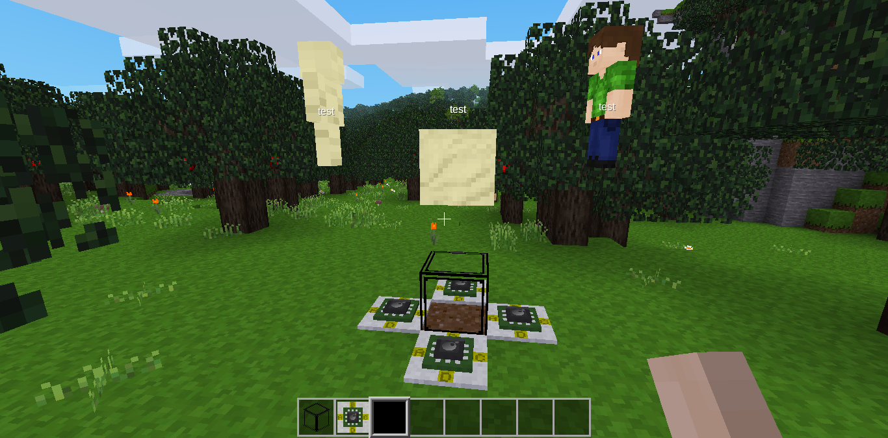
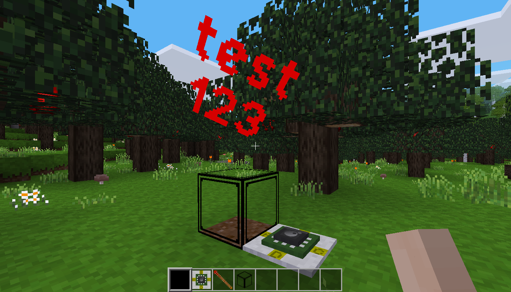

# Minetest holoemitter mod

[](https://content.minetest.net/packages/BuckarooBanzay/holoemitter/)

State: **WIP**




## TODO

* [ ] limit number of entities in a session
* [ ] recipe
* [ ] license

## Adding an entity

### Sand cube

```lua
if event.type == "program" then
  digiline_send("holoemitter", {
    command = "emit",
    pos = { x=0, y=2, z=0 },
    id = "my_entity_id",
    properties = {
      visual = "cube",
      visual_size = {x=1,y=1},
      textures = {
        "default_sand.png",
        "default_sand.png",
        "default_sand.png",
        "default_sand.png",
        "default_sand.png",
        "default_sand.png"
      },
      automatic_rotate = 1,
      glow = 10,
      physical = false,
      collide_with_objects = false,
      pointable = true,
      nametag = "test"
    }
  })
end
```

### Rotating sam

```lua
if event.type == "program" then
  digiline_send("holoemitter", {
    command = "emit",
    pos = { x=2, y=2, z=0 },
    id = "my_entity_id",
    properties = {
      visual = "mesh",
      mesh = "character.b3d",
      visual_size = {x=1,y=1},
      textures = {"character.png"},
      automatic_rotate = 1,
      glow = 10,
      physical = false,
      collide_with_objects = false,
      pointable = true,
      nametag = "test"
    }
  })
end
```

## Display text

Needs the `display_modpack`

```lua
if event.type == "program" then
	digiline_send("holoemitter", { command = "reset" })
	digiline_send("holoemitter", {
		command = "emittext",
		pos = { x=0, y=2, z=0 },
		id = "my_entity_id",
		text = "Test",
		size_x = 2,
		size_y = 1,
		rotation = { x=0, y=0, z=0 }
	})
end
```


## Resetting the emitter
```lua
if event.type == "program" then
  digiline_send("holoemitter", {
    command = "reset"
  })
end
```

## Events

Channel: "holoemitter"

### Callback

```lua
{
  playername = "singleplayer",
  id = "my_entity_id",
  action = "punch" -- or "rightclick"
}
```

### Error

```lua
{
  error = true,
	message = "visual not allowed"
}
```
